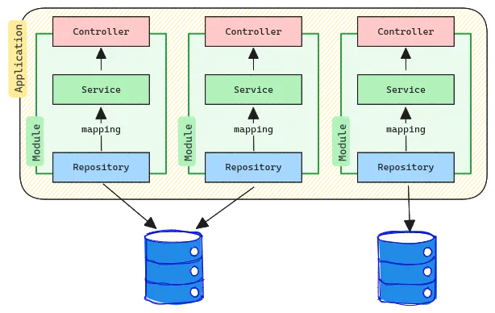
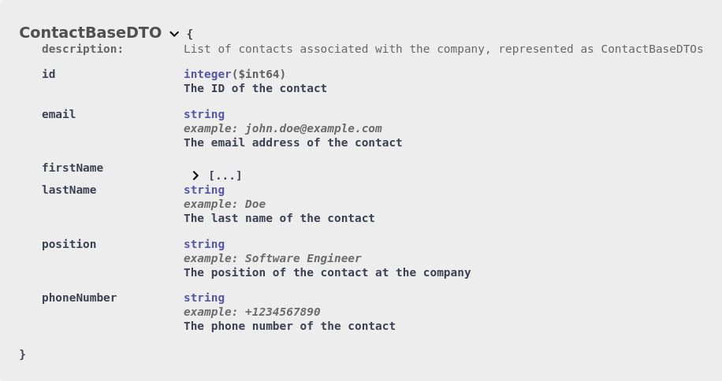
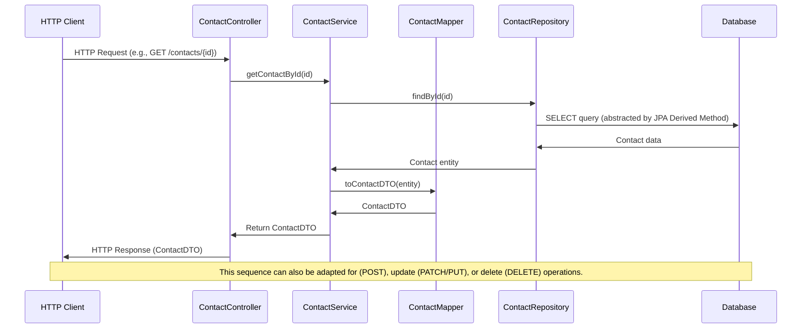
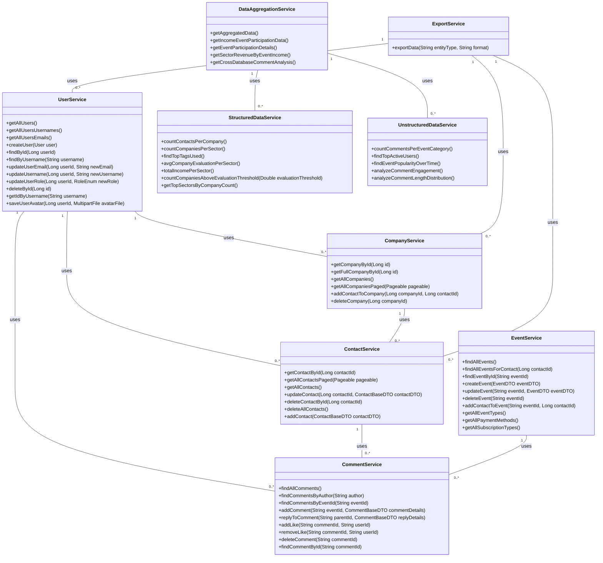

# CRM App

Un software CRM (Customer Relationship Management) gestioneaza si centralizeaza datele clienților, oferind access facil
la informații esențiale: cum ar fi feedback-ul acestora, detalii de contact, istoricul achizițiilor și
interacțiunile anterioare, atat cu serviciul pentru clienți, cat si cu intreprinderea per ansamblu.

Această centralizare, sau
poate mai degraba disponibilizarea si buna organizare a informatiei, îi ajută pe agentii de vanzari să îmbunătățească
interacțiunile cu clienții, să anticipeze nevoile și să isi urmărească obiectivele de performanță a vânzărilor. **In
esenta, obiectivul principal al unui CRM este de a face aceste interacțiuni mai eficiente și mai productive, sporind
astfel satisfacția clienților și încurajând loialitatea clienților pe termen lung.**

Desigur, exista multe alte aspecte care sunt in afara obiectivelor proiectului.
**Acest proiect isi propune realizarea unui fundament, un 'core' privind functionalitatea unei astfel de aplicatii.**

## Obiective urmărite
___

* **Aplicabilitate:** Implementarea și punerea în practică a conceptelor și tehnicilor învățate pe parcursul cursului. (e.g. OOP, MVC, Rest, Db)
* **API RESTful:** Obiectivul de referinta este conceperea unui API 100% RESTful, headless, respectând convențiile stilului
  arhitectural REST.
* **Scalabilitate și structură bine documentata:** Dezvoltarea unui backend care este ușor de scalat și bine structurat.
* **Client:** Posibilitatea de a consma acest API ca si client in mod agnostic, fara a depinde de o implementare anume,
* Dar totodata oferind o abstractizare eleganta si eficienta asupra metodelor HTTP via clientul [Vue 3](https://github.com/jxx777/crm-final-project-nuxt) de tip webapp 

## Principii de proiectare
___

Proiectul își propune aderarea la principii consacrate de proiectare a software-ului pentru a asigura mentenabilitatea
și extensibilitatea:

* **Single Responsibility Principle (SRP):** Fiecare clasă este proiectată pentru a indeplinii un scop specific, avand o
  responsabilitate bine definita.
* **Open/Closed Principle (OCP):** Sistemul este deschis pentru extindere, dar închis pentru modificare, promovând
  extensibilitatea fără a compromite funcționalitatea existentă.
* **Interface Segregation Principle (ISP):** Asigurarea faptului că clasele nu implementează interfețe sau nu sunt nevoite sa moșteneasca
  membrii din superclase pe care nu ii utilizeaza, evitându-se astfel dependințele inutile.


## Arhitectura de tip modulith
Note: Nu utilizeaza [Spring Modulith](https://spring.io/projects/spring-modulith)
___
- **Această abordare separă logic aplicația** în module funcționale, fiecare având responsabilități clare și bine definite. 
- **Ofera un echilibru pragmatic intre:** o structura rigida de tip monolith (resimtit in special atunci cand codebase-ul include si concernul de View layer) si una de tip Microservicii, (care ar reprezenta un nivel de complexitate / overhead nefezabil scopului imediat al acestui proiect)
- **Modulith-ul ajută la evitarea cuplării strânse** între componente, promovând coeziunea în cadrul fiecărui modul.
- **Aplicatia este conceputa pentru a putea scala atat vertical** (e.g adaugarea de noi metode la serviciile deja existente), **cat si orizontal** (e.g. adaugarea de noi module) **intr-o maniera predictibilia, gestionabila.**


> O baza de cod unitara, cu separare per module bine definita.


### Client-Server Separation

Arhitectura client-server implica separarea responsabilităților, unde serverul expune resurse via API, iar clientul le 'consumă'.
Prin separarea acestora, ambele părți pot evolua independent,

## Data Layer (DAL / DAO)
___
#### Componenta arhitecturata care se ocupa cu gestionarea și stocarea datelor.

Această componentă cuprinde
- Totalitatea operatiunilor pentru interacțiunea cu baza de date,
- Gestionarea operațiilor cu fluxuri de date,
- Unterogările și asigurarea integrității datelor.

Baze de date: utilizează atât baze de date de tip Relationale (PostgreSQL), cât și baze de date de tip Nonrelationale (MongoDB).

## **Entități**
Entitățile reprezintă obiectele de ce incapsuleaza, manifesteaza Business Logic-ul aplicației.
Într-un context in care interactionarea cu baza (sau bazele) de date este abstractizata via un ORM (Object-Relational Mapping), cum ar fi Spring Data JPA, o inmpelemare a JPA (Java Persistence API), fiecare entitate
corespunde unui tabel din baza de date (cel putin in cazul bazelor de date SQL), iar instanțele entităților concid intrarilor (rows) din aceste tabele.

### In cadrul entitatilor mapate in baza de date relationala (e.g PostgreSQL), `BaseEntity` serveste ca super classa / meta-blueprint pentru celalalte entitati
```java
package itschool.crmfinalproject.common.entity;

[imports]

@Setter
@Getter
@EntityListeners(AuditingEntityListener.class)
@MappedSuperclass
public class BaseEntity {
    @Id
    @GeneratedValue(strategy = GenerationType.IDENTITY)
    private Long id;

    @CreatedDate
    @Column(updatable = false)
    private LocalDateTime createdAt;

    @LastModifiedDate
    private LocalDateTime updatedAt;

    @CreatedBy
    private String createdBy;

    @LastModifiedBy
    private String updatedBy;
}
```

## Abstractizarea interactionarii cu baza de date.
### Spring Data JPA ofera un mod facil de a interactiona in mod agnostic cu fiecare baza de date, indiferent de natura acesteia.
Prin expunearea celor doua interfete, `JpaRepository` respectiv `MongoRepository`, putem efectua rapid o serie de operatiuni CRUD 'by default', fara a fi nevoie de, executarea si compunearea manuala a interogarilor, genstionarea sesiunilor de tranzactii, etc.

## `JpaRepository`
```java
package itschool.crmfinalproject.contacts.repository;

public interface ContactRepository extends JpaRepository<Contact, Long> {
  Optional<Contact> findByEmail(String email);
}
```
## `MongoRepository`
```java
package itschool.crmfinalproject.comments.repository;

public interface CommentRepository extends MongoRepository<Comment, String> {
    List<Comment> findByAuthor(String author);
}
```

## `JPQL - Java Persistence Query Language`
```java
package itschool.crmfinalproject.statistics.repository;

import itschool.crmfinalproject.contacts.entity.Contact;
import itschool.crmfinalproject.statistics.model.*;
import org.springframework.data.jpa.repository.JpaRepository;
import org.springframework.data.jpa.repository.Query;
import org.springframework.data.repository.query.Param;
import org.springframework.stereotype.Repository;

import java.util.List;

@Repository
public interface StructuredDataRepository extends JpaRepository<Contact, Long> {

    @Query("""
    SELECT new itschool.crmfinalproject.statistics.model.ContactsPerCompanyDTO(co.name, COUNT(c))
    FROM Company co JOIN co.contacts c
    GROUP BY co.name
    """)
    List<ContactsPerCompanyDTO> countContactsPerCompany();
}
```

## `MongoDb - Aggregation Pipeline`

```java
package itschool.crmfinalproject.statistics.repository;

import itschool.crmfinalproject.data.model.*;
import itschool.crmfinalproject.comments.document.Comment;
import org.springframework.data.mongodb.repository.Aggregation;
import org.springframework.data.mongodb.repository.MongoRepository;

import java.util.List;

public interface UnstructuredDataRepository extends MongoRepository<Comment, String> {

  @Aggregation(pipeline = {
          "{$lookup: {from: 'events', localField: 'eventId', foreignField: 'id', as: 'event'}}",
          "{$unwind: '$event'}",
          "{$group: {_id: '$event.eventCategory', count: {$sum: 1}}}",
          "{$project: {category: '$_id', count: 1}}"
  })
  List<CategoryCommentsCountDTO> countCommentsPerEventCategory();
}
```


### Mentinerea consecventei intre tipurile de date in contextul server / client

> In implementarea curenta a clientului se utilizeaza [Typescript](https://www.typescriptlang.org/), un superset al JavaScript care adauga un layer de type
> safety, si care ne permite sa declaram astfel de interfete de tip contractual.
>
> Se mentine astfel un raport de echilibru intre `DTO Records` emise de catre backend, ce devin mai apoi diverse structuri de date in JavaScript, structuri care urmeaza model concret

## Exemplu
___
### ContactBaseDTO - Immutable Record
```java
// Java Record DTO
package itschool.crmfinalproject.model.contact;

public record ContactBaseDTO(
        Long id,
        String email,
        String firstName,
        String lastName,
        String position,
        String phoneNumber
) {
}
 ```

### OpenApi Schema - Type Definition



### Typescript Interface - Contract Binding
```typescript
// TypeScript Interface
export interface ContactBaseDTO {
    id: number;
    email: string;
    firstName: string;
    lastName: string;
    phoneNumber: string;
}

let typedContactObject: ContactBaseDTO = new Contact();
typedContactObject.email = "foo@example.com" // ok
typedContactObject.phoneNumber = 12345 // not ok
```

## Diagrama de secventa de mai jos ilustreaza parcursul unui flux standard de transmitere de date, din momentul in care este facut un `request` de catre client, procesat de catre server, trimis mai apoi ca DTO sub forma de JSON (`response`) 
___


Restful API
-----------------------
Totalitatea Controllerellor sunt de tip `@RestController`, endpointurile expuse putand fii astfel consumate / folosite in mod agnostic, indiferent de natura clientului:


```java
@RestController
@RequestMapping("/contacts")
@RequiredArgsConstructor
@Tag(name = "Contact Service", description = "Facilitates CRUD operations for contact entities, offering detailed data access and management.")
public class ContactController {

    private final ContactService contactService;

    @Operation(summary = "Get a contact by ID")
    @ApiResponse(responseCode = "200", description = "Successfully retrieved the contact")
    @GetMapping("/{contactId}")
    public ResponseEntity<?> getContact(@PathVariable @Parameter(description = "ID of the contact to retrieve", example = "1") Long contactId) {
        ContactDTO contact = contactService.getContactById(contactId);
        return ResponseEntity.ok(contact);
    }
}
```


### CLI / Terminal-based client (cURL, httpie, etc)
```bash
set id = 12

curl -X 'GET' \
  'http://localhost:8080/contacts/{id}}' \
  -H 'accept: */*'
```

### HttpClient - Specificatie W3C 
```http request
@contactId = 12
GET /contacts/{{contactId}} HTTP/1.1
Host: localhost:8080
Accept: */*
```

### Swift HTTP Method (Folosit in applicatii client in ecosistemul Apple, oferit ca exemplu pentru a evidentia independenta intre platforme)
```c
var request = URLRequest(url: URL(string: "http://localhost:8080/statistics/top-tags")!,timeoutInterval: Double.infinity)
request.addValue("*/*", forHTTPHeaderField: "Accept")

request.httpMethod = "GET"

let task = URLSession.shared.dataTask(with: request) { data, response, error in 
  guard let data = data else {
    print(String(describing: error))
    return
  }
  print(String(data: data, encoding: .utf8)!)
}

task.resume()

```


Service Layer
-----------------------
Se poate observa


